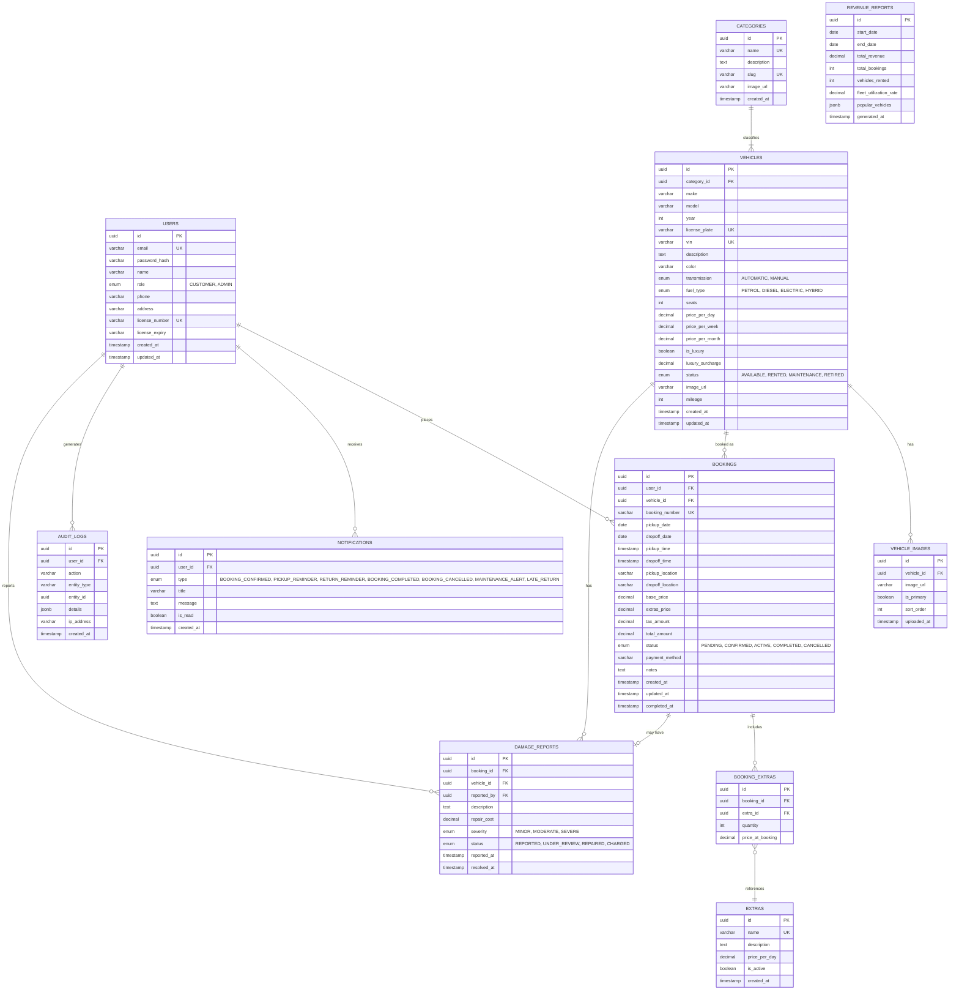

# ER Diagram

## Overview

This Entity-Relationship diagram shows the complete database schema for the DriveElite Car Rental platform. All tables, columns, data types, primary keys (PK), foreign keys (FK), and unique constraints (UK) are defined below.

---

---

## Table Descriptions

| Table | Description | Key Relationships |
|-------|-------------|-------------------|
| **USERS** | All platform users (customers and admins) with authentication and license info | → Bookings (1:N), Notifications (1:N), DamageReports (1:N) |
| **CATEGORIES** | Vehicle types (Economy, Sedan, SUV, Luxury, Sports) | → Vehicles (1:N) |
| **VEHICLES** | Complete vehicle fleet with specs, pricing, and availability status | ← Category, → Bookings (1:N), → VehicleImages (1:N), → DamageReports (1:N) |
| **VEHICLE_IMAGES** | Gallery images for each vehicle | ← Vehicle |
| **BOOKINGS** | Customer rental bookings with date ranges, pricing, and status | ← User, ← Vehicle, → BookingExtras (1:N) |
| **BOOKING_EXTRAS** | Add-on items for a booking (GPS, insurance, child seat) | ← Booking, → Extra |
| **EXTRAS** | Available add-on items with pricing | → BookingExtras (1:N) |
| **DAMAGE_REPORTS** | Vehicle damage reports filed during/after a rental | ← Booking, ← Vehicle, ← User |
| **NOTIFICATIONS** | User notifications for booking updates and alerts | ← User |
| **REVENUE_REPORTS** | Aggregated business analytics and fleet utilization reports | Standalone |
| **AUDIT_LOGS** | System-wide audit trail for compliance and debugging | ← User (optional) |

---

## Key Constraints & Indexes

### Primary Keys
- All tables use `uuid` as primary key for distributed scalability

### Unique Constraints
- `USERS.email` — Prevent duplicate accounts
- `USERS.license_number` — One license per user
- `VEHICLES.license_plate` — Unique vehicle registration
- `VEHICLES.vin` — Unique Vehicle Identification Number
- `CATEGORIES.name` — Prevent duplicate category names
- `CATEGORIES.slug` — SEO-friendly unique identifiers
- `BOOKINGS.booking_number` — Human-readable unique booking identifier
- `EXTRAS.name` — Prevent duplicate add-on names

### Foreign Key Constraints
- `VEHICLES.category_id → CATEGORIES.id` (ON DELETE SET NULL)
- `VEHICLE_IMAGES.vehicle_id → VEHICLES.id` (ON DELETE CASCADE)
- `BOOKINGS.user_id → USERS.id` (ON DELETE RESTRICT)
- `BOOKINGS.vehicle_id → VEHICLES.id` (ON DELETE RESTRICT)
- `BOOKING_EXTRAS.booking_id → BOOKINGS.id` (ON DELETE CASCADE)
- `BOOKING_EXTRAS.extra_id → EXTRAS.id` (ON DELETE RESTRICT)
- `DAMAGE_REPORTS.booking_id → BOOKINGS.id` (ON DELETE RESTRICT)
- `DAMAGE_REPORTS.vehicle_id → VEHICLES.id` (ON DELETE RESTRICT)
- `DAMAGE_REPORTS.reported_by → USERS.id` (ON DELETE SET NULL)
- `NOTIFICATIONS.user_id → USERS.id` (ON DELETE CASCADE)
- `AUDIT_LOGS.user_id → USERS.id` (ON DELETE SET NULL)

### Recommended Indexes

| Table | Index | Purpose |
|-------|-------|---------| 
| `VEHICLES` | `(category_id, status)` | Fast category filtering with availability check |
| `VEHICLES` | `(make, model, year)` | Vehicle search optimization |
| `VEHICLES` | `(is_luxury, status)` | Luxury fleet queries |
| `BOOKINGS` | `(user_id, status)` | User booking history queries |
| `BOOKINGS` | `(vehicle_id, pickup_date, dropoff_date)` | Availability conflict detection |
| `BOOKINGS` | `(status, created_at)` | Admin booking dashboard filtering |
| `BOOKING_EXTRAS` | `(booking_id)` | Fast booking details retrieval |
| `NOTIFICATIONS` | `(user_id, is_read)` | Unread notification count |
| `DAMAGE_REPORTS` | `(vehicle_id, status)` | Vehicle damage history |
| `AUDIT_LOGS` | `(entity_type, entity_id)` | Entity audit trail lookup |
| `AUDIT_LOGS` | `(created_at)` | Time-based log queries |

---

## Data Integrity Rules

1. **Availability Validation**: Bookings cannot be created for vehicles with status other than `AVAILABLE`, and date ranges cannot overlap with existing bookings for the same vehicle.
2. **Booking Immutability**: Once a booking is `ACTIVE` or `COMPLETED`, its core details (vehicle, dates) cannot be modified.
3. **Price Snapshot**: `BOOKING_EXTRAS.price_at_booking` and `BOOKINGS.base_price` capture pricing at booking time (historical record).
4. **Cascade Deletes**: Deleting a booking removes associated extras automatically.
5. **Audit Trail**: All critical operations (booking creation, status changes, fleet updates, damage reports) logged in `AUDIT_LOGS`.
6. **License Requirement**: Customers must have a valid `license_number` to create bookings.
7. **Vehicle State Machine**: Vehicle status transitions follow strict rules (e.g., `RENTED` can only become `AVAILABLE` or `MAINTENANCE`).

---

## Scalability Considerations

- **Partitioning**: `BOOKINGS` and `AUDIT_LOGS` can be partitioned by `created_at` for time-series queries
- **Archiving**: Old completed bookings (>1 year) can be moved to archive tables
- **Caching**: Vehicle catalog queries cached with Redis to reduce database load
- **Read Replicas**: Separate read replicas for analytics and reporting queries
- **UUID Keys**: Distributed-friendly primary keys for horizontal scaling
- **Availability Index**: Composite index on `(vehicle_id, pickup_date, dropoff_date)` for fast overlap detection
