```mermaid
classDiagram
    direction TB

    %% ===== DOMAIN MODELS =====

    class User {
        -id: string
        -email: string
        -passwordHash: string
        -name: string
        -role: UserRole
        -phone: string
        -address: string
        -licenseNumber: string
        -licenseExpiry: Date
        -createdAt: Date
        +register(dto: RegisterDto): User
        +login(email: string, password: string): string
        +updateProfile(dto: UpdateProfileDto): void
        +changePassword(oldPass: string, newPass: string): void
        +getBookings(): Booking[]
        +isLicenseValid(): boolean
    }

    class UserRole {
        <<enumeration>>
        CUSTOMER
        ADMIN
    }

    class Vehicle {
        -id: string
        -make: string
        -model: string
        -year: number
        -licensePlate: string
        -vin: string
        -description: string
        -color: string
        -transmission: TransmissionType
        -fuelType: FuelType
        -seats: number
        -pricePerDay: number
        -pricePerWeek: number
        -pricePerMonth: number
        -isLuxury: boolean
        -luxurySurcharge: number
        -status: VehicleStatus
        -categoryId: string
        -imageUrl: string
        -mileage: number
        -createdAt: Date
        -updatedAt: Date
        +isAvailable(): boolean
        +setStatus(status: VehicleStatus): void
        +updateDetails(dto: UpdateVehicleDto): void
        +calculatePrice(days: number): number
        +isLuxuryClass(): boolean
        +needsMaintenance(): boolean
    }

    class TransmissionType {
        <<enumeration>>
        AUTOMATIC
        MANUAL
    }

    class FuelType {
        <<enumeration>>
        PETROL
        DIESEL
        ELECTRIC
        HYBRID
    }

    class VehicleStatus {
        <<enumeration>>
        AVAILABLE
        RENTED
        MAINTENANCE
        RETIRED
    }

    class Category {
        -id: string
        -name: string
        -description: string
        -slug: string
        -imageUrl: string
        -createdAt: Date
        +getVehicles(): Vehicle[]
        +getVehicleCount(): number
    }

    class Booking {
        -id: string
        -userId: string
        -vehicleId: string
        -bookingNumber: string
        -pickupDate: Date
        -dropoffDate: Date
        -pickupTime: Date
        -dropoffTime: Date
        -pickupLocation: string
        -dropoffLocation: string
        -basePrice: number
        -extrasPrice: number
        -taxAmount: number
        -totalAmount: number
        -status: BookingStatus
        -paymentMethod: string
        -notes: string
        -createdAt: Date
        -updatedAt: Date
        -completedAt: Date?
        +calculateTotal(): number
        +updateStatus(newStatus: BookingStatus): void
        +cancel(): void
        +getExtras(): BookingExtra[]
        +canBeCancelled(): boolean
        +getDurationDays(): number
        +extend(newDropoffDate: Date): void
        +isOverdue(): boolean
    }

    class BookingStatus {
        <<enumeration>>
        PENDING
        CONFIRMED
        ACTIVE
        COMPLETED
        CANCELLED
    }

    class BookingExtra {
        -id: string
        -bookingId: string
        -extraId: string
        -quantity: number
        -priceAtBooking: number
        +getSubtotal(): number
    }

    class Extra {
        -id: string
        -name: string
        -description: string
        -pricePerDay: number
        -isActive: boolean
        -createdAt: Date
        +calculateCost(days: number): number
    }

    class VehicleImage {
        -id: string
        -vehicleId: string
        -imageUrl: string
        -isPrimary: boolean
        -sortOrder: number
        -uploadedAt: Date
    }

    class DamageReport {
        -id: string
        -bookingId: string
        -vehicleId: string
        -reportedBy: string
        -description: string
        -repairCost: number
        -severity: DamageSeverity
        -status: DamageStatus
        -reportedAt: Date
        -resolvedAt: Date?
        +resolve(cost: number): void
        +markCharged(): void
    }

    class DamageSeverity {
        <<enumeration>>
        MINOR
        MODERATE
        SEVERE
    }

    class DamageStatus {
        <<enumeration>>
        REPORTED
        UNDER_REVIEW
        REPAIRED
        CHARGED
    }

    class Notification {
        -id: string
        -userId: string
        -type: NotificationType
        -title: string
        -message: string
        -isRead: boolean
        -createdAt: Date
        +markAsRead(): void
    }

    class NotificationType {
        <<enumeration>>
        BOOKING_CONFIRMED
        PICKUP_REMINDER
        RETURN_REMINDER
        BOOKING_COMPLETED
        BOOKING_CANCELLED
        MAINTENANCE_ALERT
        LATE_RETURN
    }

    class RevenueReport {
        -id: string
        -startDate: Date
        -endDate: Date
        -totalRevenue: number
        -totalBookings: number
        -vehiclesRented: number
        -fleetUtilizationRate: number
        -popularVehicles: Vehicle[]
        -generatedAt: Date
        +generate(): void
        +exportToPDF(): void
    }

    %% ===== SERVICE LAYER =====

    class AuthService {
        -userRepo: IUserRepository
        -jwtSecret: string
        +register(dto: RegisterDto): User
        +login(email: string, password: string): string
        +validateToken(token: string): User
        +hashPassword(password: string): string
        +comparePassword(plain: string, hash: string): boolean
    }

    class VehicleService {
        -vehicleRepo: IVehicleRepository
        -categoryRepo: ICategoryRepository
        -searchStrategy: ISearchStrategy
        +getAllVehicles(filters: VehicleFilters): Vehicle[]
        +getVehicleById(id: string): Vehicle
        +searchVehicles(query: string): Vehicle[]
        +getVehiclesByCategory(categoryId: string): Vehicle[]
        +getLuxuryVehicles(): Vehicle[]
        +createVehicle(dto: CreateVehicleDto): Vehicle
        +updateVehicle(id: string, dto: UpdateVehicleDto): Vehicle
        +deleteVehicle(id: string): void
        +setSearchStrategy(strategy: ISearchStrategy): void
        +checkAvailability(vehicleId: string, from: Date, to: Date): boolean
    }

    class ISearchStrategy {
        <<interface>>
        +search(query: string, vehicles: Vehicle[]): Vehicle[]
    }

    class MakeModelSearchStrategy {
        +search(query: string, vehicles: Vehicle[]): Vehicle[]
    }

    class CategorySearchStrategy {
        +search(query: string, vehicles: Vehicle[]): Vehicle[]
    }

    class FullTextSearchStrategy {
        +search(query: string, vehicles: Vehicle[]): Vehicle[]
    }

    class BookingService {
        -bookingRepo: IBookingRepository
        -vehicleService: VehicleService
        -pricingService: PricingService
        -fleetService: FleetService
        -validationChain: BookingValidator
        +createBooking(userId: string, dto: CreateBookingDto): Booking
        +getBookingById(id: string): Booking
        +getCustomerBookings(userId: string): Booking[]
        +getAllBookings(filters: BookingFilters): Booking[]
        +updateBookingStatus(bookingId: string, status: BookingStatus): Booking
        +cancelBooking(bookingId: string): void
        +extendBooking(bookingId: string, newDropoff: Date): Booking
        +getOverdueBookings(): Booking[]
    }

    class PricingService {
        -pricingStrategy: IPricingStrategy
        +calculatePrice(vehicle: Vehicle, days: number, extras: Extra[]): PriceBreakdown
        +setPricingStrategy(strategy: IPricingStrategy): void
        +applySeasonalRate(basePrice: number, date: Date): number
        +calculateLuxurySurcharge(vehicle: Vehicle, days: number): number
    }

    class IPricingStrategy {
        <<interface>>
        +calculate(vehicle: Vehicle, days: number): number
    }

    class DailyPricingStrategy {
        +calculate(vehicle: Vehicle, days: number): number
    }

    class WeeklyPricingStrategy {
        +calculate(vehicle: Vehicle, days: number): number
    }

    class LuxuryPricingStrategy {
        +calculate(vehicle: Vehicle, days: number): number
    }

    class FleetService {
        -vehicleRepo: IVehicleRepository
        -notificationService: NotificationService
        +getFleetStatus(): FleetStatus
        +updateVehicleStatus(vehicleId: string, status: VehicleStatus): void
        +markForMaintenance(vehicleId: string): void
        +markAvailable(vehicleId: string): void
        +retireVehicle(vehicleId: string): void
        +getAvailableVehicles(from: Date, to: Date): Vehicle[]
        +checkAndNotifyMaintenance(): void
    }

    class NotificationService {
        -notificationRepo: INotificationRepository
        -observers: INotificationObserver[]
        +subscribe(observer: INotificationObserver): void
        +notify(event: NotificationEvent): void
        +sendNotification(userId: string, notification: Notification): void
        +getUserNotifications(userId: string): Notification[]
        +markAsRead(notificationId: string): void
    }

    class INotificationObserver {
        <<interface>>
        +onEvent(event: NotificationEvent): void
    }

    class EmailNotificationObserver {
        +onEvent(event: NotificationEvent): void
    }

    class InAppNotificationObserver {
        +onEvent(event: NotificationEvent): void
    }

    class AnalyticsService {
        -bookingRepo: IBookingRepository
        -vehicleRepo: IVehicleRepository
        +generateRevenueReport(startDate: Date, endDate: Date): RevenueReport
        +getTotalRevenue(period: string): number
        +getMostBookedVehicles(limit: number): Vehicle[]
        +getFleetUtilization(): number
        +getBookingStats(): BookingStats
        +getLuxurySegmentMetrics(): LuxuryMetrics
    }

    %% ===== VALIDATION CHAIN =====

    class BookingValidator {
        <<abstract>>
        #next: BookingValidator
        +setNext(validator: BookingValidator): BookingValidator
        +validate(booking: Booking): ValidationResult
        #doValidate(booking: Booking): ValidationResult*
    }

    class AvailabilityValidator {
        #doValidate(booking: Booking): ValidationResult
    }

    class LicenseValidator {
        #doValidate(booking: Booking): ValidationResult
    }

    class DateRangeValidator {
        #doValidate(booking: Booking): ValidationResult
    }

    class PaymentValidator {
        #doValidate(booking: Booking): ValidationResult
    }

    %% ===== REPOSITORY INTERFACES =====

    class IUserRepository {
        <<interface>>
        +findById(id: string): User
        +findByEmail(email: string): User
        +save(user: User): User
        +update(user: User): void
        +delete(id: string): void
    }

    class IVehicleRepository {
        <<interface>>
        +findById(id: string): Vehicle
        +findAll(filters: VehicleFilters): Vehicle[]
        +findByCategory(categoryId: string): Vehicle[]
        +findLuxury(): Vehicle[]
        +findAvailable(from: Date, to: Date): Vehicle[]
        +save(vehicle: Vehicle): Vehicle
        +update(vehicle: Vehicle): void
        +delete(id: string): void
        +search(query: string): Vehicle[]
    }

    class ICategoryRepository {
        <<interface>>
        +findById(id: string): Category
        +findAll(): Category[]
        +save(category: Category): Category
        +update(category: Category): void
        +delete(id: string): void
    }

    class IBookingRepository {
        <<interface>>
        +findById(id: string): Booking
        +findByUserId(userId: string): Booking[]
        +findAll(filters: BookingFilters): Booking[]
        +findOverdue(): Booking[]
        +save(booking: Booking): Booking
        +update(booking: Booking): void
        +getBookingStats(): BookingStats
    }

    class INotificationRepository {
        <<interface>>
        +findByUserId(userId: string): Notification[]
        +save(notification: Notification): Notification
        +update(notification: Notification): void
    }

    %% ===== RELATIONSHIPS =====

    User --> UserRole
    User "1" --> "*" Booking : places
    User "1" --> "*" Notification : receives

    Vehicle --> TransmissionType
    Vehicle --> FuelType
    Vehicle --> VehicleStatus
    Vehicle --> Category : belongs to
    Vehicle "1" --> "*" VehicleImage : has
    Vehicle "1" --> "*" Booking : booked in
    Vehicle "1" --> "*" DamageReport : has

    Booking --> BookingStatus
    Booking "1" --> "*" BookingExtra : includes
    Booking "1" --> "0..1" DamageReport : may have
    BookingExtra --> Extra : references

    DamageReport --> DamageSeverity
    DamageReport --> DamageStatus

    Notification --> NotificationType

    %% Service dependencies
    AuthService --> IUserRepository
    VehicleService --> IVehicleRepository
    VehicleService --> ICategoryRepository
    VehicleService --> ISearchStrategy
    ISearchStrategy <|.. MakeModelSearchStrategy : implements
    ISearchStrategy <|.. CategorySearchStrategy : implements
    ISearchStrategy <|.. FullTextSearchStrategy : implements

    BookingService --> IBookingRepository
    BookingService --> VehicleService
    BookingService --> PricingService
    BookingService --> FleetService
    BookingService --> BookingValidator

    PricingService --> IPricingStrategy
    IPricingStrategy <|.. DailyPricingStrategy : implements
    IPricingStrategy <|.. WeeklyPricingStrategy : implements
    IPricingStrategy <|.. LuxuryPricingStrategy : implements

    FleetService --> IVehicleRepository
    FleetService --> NotificationService

    NotificationService --> INotificationRepository
    NotificationService --> INotificationObserver
    INotificationObserver <|.. EmailNotificationObserver : implements
    INotificationObserver <|.. InAppNotificationObserver : implements

    AnalyticsService --> IBookingRepository
    AnalyticsService --> IVehicleRepository

    %% Validation chain
    BookingValidator <|-- AvailabilityValidator : extends
    BookingValidator <|-- LicenseValidator : extends
    BookingValidator <|-- DateRangeValidator : extends
    BookingValidator <|-- PaymentValidator : extends
```

# Class Diagram

## Overview

This class diagram shows the major classes, their attributes, methods, and relationships across the DriveElite Car Rental platform. The design follows **Clean Architecture** (Controller → Service → Repository) with strong **OOP principles** and **design patterns**.

---



---

## Design Patterns in the Class Diagram

| Pattern | Where Applied | Purpose |
|---------|---------------|---------|
| **Strategy** | `ISearchStrategy` with multiple implementations | Allow switching between different search algorithms (make/model, category, full-text) at runtime |
| **Strategy** | `IPricingStrategy` with daily, weekly, luxury pricing | Dynamic pricing calculation based on rental duration and vehicle class |
| **Chain of Responsibility** | `BookingValidator` chain | Validate bookings through a pipeline (availability, license, date range, payment) |
| **Observer** | `NotificationService` + `INotificationObserver` | Decouple booking events from notification delivery (email, in-app) |
| **Repository** | `I*Repository` interfaces | Abstract data access from business logic, enable easy testing and database switching |
| **Singleton** | Database connection (not shown) | Ensure single database connection pool instance |
| **Factory** | Vehicle creation by category | Create different vehicle types based on category |
| **Decorator** | `BookingExtra` add-ons | Adding extras to bookings (GPS, insurance, child seat) that modify total price |
| **State** | `BookingStatus` and `VehicleStatus` enums | Manage booking lifecycle and vehicle state transitions |

---

## OOP Principles Applied

| Principle | Application |
|-----------|-------------|
| **Encapsulation** | Private fields (`-`) with public methods (`+`) in all domain models. Example: `Booking.calculateTotal()` encapsulates pricing logic |
| **Abstraction** | Repository interfaces (`IVehicleRepository`, `IBookingRepository`) hide implementation details from services |
| **Inheritance** | `BookingValidator` is extended by specific validators (`AvailabilityValidator`, `LicenseValidator`) |
| **Polymorphism** | `IPricingStrategy` implementations can be swapped at runtime; `ISearchStrategy` supports multiple search modes |

---

## Layer Architecture

```
┌─────────────────────────────────────┐
│     Controllers (API Endpoints)     │
├─────────────────────────────────────┤
│     Services (Business Logic)       │
│  - AuthService                      │
│  - VehicleService                   │
│  - BookingService                   │
│  - PricingService                   │
│  - FleetService                     │
│  - NotificationService              │
│  - AnalyticsService                 │
├─────────────────────────────────────┤
│   Repositories (Data Access)        │
│  - IUserRepository                  │
│  - IVehicleRepository               │
│  - IBookingRepository               │
│  - ICategoryRepository              │
├─────────────────────────────────────┤
│        Database (PostgreSQL)        │
└─────────────────────────────────────┘
```

---

## Key Class Responsibilities

| Class | Responsibility |
|-------|----------------|
| `User` | Manage user authentication, profile, license info, and roles |
| `Vehicle` | Represent vehicle entity with specs, pricing, and availability status |
| `Booking` | Represent customer rental booking with date range and status lifecycle |
| `PricingService` | Calculate rental prices based on duration, vehicle class, and extras |
| `BookingService` | Orchestrate booking creation with validation, pricing, and fleet management |
| `FleetService` | Handle vehicle status management, availability, and maintenance scheduling |
| `NotificationService` | Send notifications through multiple channels using Observer pattern |
| `AnalyticsService` | Generate revenue reports, fleet utilization, and business insights |
