```mermaid
sequenceDiagram
    actor C as Customer
    actor A as Admin
    participant FE as Frontend (React)
    participant API as API Gateway
    participant Auth as Auth Service
    participant VS as Vehicle Service
    participant PS as Pricing Service
    participant BS as Booking Service
    participant FS as Fleet Service
    participant NS as Notification Service
    participant DB as PostgreSQL

    Note over C, DB: Phase 1 — Customer Browses & Searches Vehicles

    C ->> FE: Opens DriveElite homepage
    FE ->> API: GET /api/vehicles?page=1&limit=20&status=AVAILABLE
    API ->> VS: fetchVehicles(filters)
    VS ->> DB: SELECT * FROM vehicles WHERE status = 'AVAILABLE'
    DB -->> VS: Vehicle list with details
    VS -->> API: Vehicles data
    API -->> FE: 200 OK (vehicles array)
    FE -->> C: Display vehicle catalog grid

    C ->> FE: Filters by "Luxury" category
    FE ->> API: GET /api/vehicles?category=luxury&is_luxury=true
    API ->> VS: getLuxuryVehicles()
    VS ->> DB: SELECT * FROM vehicles WHERE is_luxury = true AND status = 'AVAILABLE'
    DB -->> VS: Luxury vehicles
    VS -->> API: Luxury fleet
    API -->> FE: 200 OK (luxury vehicles)
    FE -->> C: Show luxury showcase

    C ->> FE: Searches "BMW X5"
    FE ->> API: GET /api/vehicles/search?q=BMW+X5
    API ->> VS: searchVehicles(query)
    VS ->> DB: SELECT * WHERE make LIKE '%BMW%' OR model LIKE '%X5%'
    DB -->> VS: Matching vehicles
    VS -->> API: Search results
    API -->> FE: 200 OK (filtered vehicles)
    FE -->> C: Show search results

    Note over C, DB: Phase 2 — Select Vehicle & Check Availability

    C ->> FE: Clicks on BMW X5 to view details
    FE ->> API: GET /api/vehicles/42
    API ->> VS: getVehicleById(42)
    VS ->> DB: SELECT v.*, vi.* FROM vehicles v LEFT JOIN vehicle_images vi ON v.id = vi.vehicle_id WHERE v.id = 42
    DB -->> VS: Vehicle details with images
    VS -->> API: Vehicle data
    API -->> FE: 200 OK (vehicle details)
    FE -->> C: Display vehicle details page (specs, gallery, pricing)

    C ->> FE: Selects dates: Feb 20 - Feb 25 (5 days)
    FE ->> API: GET /api/vehicles/42/availability?from=2026-02-20&to=2026-02-25
    API ->> VS: checkAvailability(42, from, to)
    VS ->> DB: SELECT * FROM bookings WHERE vehicle_id = 42 AND status IN ('CONFIRMED', 'ACTIVE') AND dates overlap
    DB -->> VS: No conflicting bookings
    VS -->> API: Available = true

    API ->> PS: calculatePrice(vehicle, 5 days)
    PS ->> PS: Apply daily rate ($120/day × 5)
    PS ->> PS: Apply luxury surcharge ($50/day × 5)
    PS -->> API: Price breakdown {base: $600, luxury: $250, tax: $85, total: $935}

    API -->> FE: 200 OK {available: true, price: $935}
    FE -->> C: "Available! Total: $935 for 5 days"

    Note over C, DB: Phase 3 — Add Extras & Create Booking

    C ->> FE: Selects extras: GPS ($10/day), Insurance Premium ($25/day)
    FE ->> API: POST /api/bookings {vehicleId: 42, pickupDate, dropoffDate, extras: [{gps, 1}, {insurance, 1}]}
    API ->> Auth: Validate JWT Token
    Auth -->> API: Token Valid (userId: 123, role: CUSTOMER)

    API ->> BS: createBooking(userId, bookingDto)
    BS ->> DB: BEGIN TRANSACTION

    %% Validate booking
    BS ->> BS: Run validation chain (availability, license, dates, payment)
    BS ->> DB: Check user license validity
    DB -->> BS: License valid, expires 2028

    BS ->> VS: checkAvailability(42, dates)
    VS ->> DB: SELECT conflicting bookings
    DB -->> VS: No conflicts

    alt Vehicle Available & User Valid
        %% Calculate final price
        BS ->> PS: calculatePrice(vehicle, 5, extras)
        PS -->> BS: {base: $600, luxury: $250, extras: $175, tax: $102.50, total: $1127.50}

        %% Create booking
        BS ->> DB: INSERT INTO bookings (user_id, vehicle_id, total_amount, status: 'PENDING')
        DB -->> BS: Booking created (bookingId: 777)

        %% Create booking extras
        BS ->> DB: INSERT INTO booking_extras (booking_id, extra_id, quantity, price_at_booking)
        DB -->> BS: Extras linked

        %% Update vehicle status
        BS ->> FS: reserveVehicle(42)
        FS ->> DB: UPDATE vehicles SET status = 'RENTED' WHERE id = 42
        DB -->> FS: Vehicle reserved

        BS ->> DB: COMMIT TRANSACTION

        %% Send notification
        BS ->> NS: notifyBookingCreated(bookingId, userId)
        NS ->> DB: INSERT INTO notifications (user_id, type: 'BOOKING_CONFIRMED', message)

        BS -->> API: 201 Created {bookingId: 777, status: 'PENDING'}
        API -->> FE: Booking placed successfully
        FE -->> C: "Booking #777 confirmed! Pickup: Feb 20, 10:00 AM"

    else Vehicle Unavailable or License Expired
        BS ->> DB: ROLLBACK TRANSACTION
        BS -->> API: 400 Bad Request "Vehicle no longer available" / "License expired"
        API -->> FE: Error response
        FE -->> C: "Sorry, this vehicle is no longer available for selected dates."
    end

    Note over C, DB: Phase 4 — Booking Fulfillment (Admin Side)

    A ->> FE: Logs into admin dashboard
    FE ->> API: GET /api/admin/bookings?status=PENDING
    API ->> Auth: Validate JWT Token (admin)
    Auth -->> API: Token Valid (role: ADMIN)
    API ->> BS: getPendingBookings()
    BS ->> DB: SELECT * FROM bookings WHERE status = 'PENDING'
    DB -->> BS: Pending bookings list
    BS -->> API: Bookings data
    API -->> FE: 200 OK (pending bookings)
    FE -->> A: Display bookings dashboard

    A ->> FE: Clicks on Booking #777 to view details
    FE ->> API: GET /api/admin/bookings/777
    API ->> BS: getBookingDetails(777)
    BS ->> DB: SELECT b.*, be.*, v.*, u.* FROM bookings b JOIN vehicles v JOIN users u
    DB -->> BS: Complete booking details
    BS -->> API: Booking details
    API -->> FE: 200 OK (booking data)
    FE -->> A: Show booking details page

    A ->> FE: Confirms booking — Updates status to "CONFIRMED"
    FE ->> API: PATCH /api/admin/bookings/777/status {status: 'CONFIRMED'}
    API ->> BS: updateBookingStatus(777, 'CONFIRMED')
    BS ->> DB: UPDATE bookings SET status = 'CONFIRMED', updated_at = NOW()
    DB -->> BS: Booking updated

    BS ->> NS: notifyStatusChange(bookingId: 777, newStatus: 'CONFIRMED')
    NS ->> DB: INSERT INTO notifications (user_id, message)

    BS -->> API: 200 OK (updated booking)
    API -->> FE: Status updated
    FE -->> A: "Booking confirmed ✓"

    Note over A: Customer arrives for pickup

    A ->> FE: Updates status to "ACTIVE" (vehicle handed over)
    FE ->> API: PATCH /api/admin/bookings/777/status {status: 'ACTIVE'}
    API ->> BS: updateBookingStatus(777, 'ACTIVE')
    BS ->> DB: UPDATE bookings SET status = 'ACTIVE'
    DB -->> BS: Updated
    BS ->> NS: notifyStatusChange(777, 'ACTIVE')
    BS -->> API: 200 OK
    FE -->> A: "Rental is now ACTIVE"

    Note over C: Customer checks booking status

    C ->> FE: Views "My Bookings"
    FE ->> API: GET /api/bookings
    API ->> BS: getCustomerBookings(userId: 123)
    BS ->> DB: SELECT * FROM bookings WHERE user_id = 123
    DB -->> BS: Customer bookings
    BS -->> API: Bookings with latest status
    API -->> FE: 200 OK
    FE -->> C: "Booking #777 - Status: ACTIVE 🚗"

    Note over A: Customer returns vehicle

    A ->> FE: Updates status to "COMPLETED"
    FE ->> API: PATCH /api/admin/bookings/777/status {status: 'COMPLETED'}
    API ->> BS: updateBookingStatus(777, 'COMPLETED')
    BS ->> DB: UPDATE bookings SET status = 'COMPLETED', completed_at = NOW()
    DB -->> BS: Booking completed

    BS ->> FS: releaseVehicle(42)
    FS ->> DB: UPDATE vehicles SET status = 'AVAILABLE' WHERE id = 42
    DB -->> FS: Vehicle available again

    BS ->> NS: notifyStatusChange(777, 'COMPLETED')
    BS -->> API: 200 OK
    FE -->> A: "Rental completed ✓ Vehicle returned and available"
```

# Sequence Diagram

## Main Flow: End-to-End Car Rental (Browse → Select Vehicle → Book → Rental Fulfillment)

This sequence diagram illustrates the complete lifecycle of a car rental — from browsing the fleet, selecting a vehicle, completing a booking, through to pickup and admin fulfillment.

---



---

## Flow Summary

| Phase | Description | Key Operations |
|-------|-------------|----------------|
| **1. Browse & Search** | Customer browses fleet catalog and searches for vehicles | Vehicle listing, category filtering, luxury showcase, search queries |
| **2. Select & Check** | Customer selects vehicle, picks dates, checks availability | Availability verification, dynamic price calculation, date conflict detection |
| **3. Book & Confirm** | Customer adds extras and places booking | Validation chain, price breakdown, booking creation, vehicle reservation |
| **4. Fulfillment** | Admin confirms booking, manages pickup and return | Status updates (PENDING → CONFIRMED → ACTIVE → COMPLETED), vehicle release, notifications |

---

## Booking Status Workflow

```
PENDING → CONFIRMED → ACTIVE → COMPLETED
   ↓          ↓
CANCELLED  (before pickup)
```

---

## Vehicle Status Workflow

```
AVAILABLE → RENTED → AVAILABLE
    ↓          ↓
MAINTENANCE    MAINTENANCE → AVAILABLE
    ↓
RETIRED (permanent)
```

---

## Key Design Patterns Used

| Pattern | Where Applied | Purpose |
|---------|---------------|---------|
| **Repository** | Database access via services | Abstraction of data access logic |
| **Service Layer** | VehicleService, BookingService, PricingService, FleetService | Separation of business logic from controllers |
| **Strategy** | PricingService with daily/weekly/luxury pricing | Dynamic pricing based on rental type and vehicle class |
| **Transaction Management** | Booking creation process | Ensure atomicity (all-or-nothing) for booking placement |
| **Observer** | NotificationService | Decouple booking events from notification logic |
| **Chain of Responsibility** | BookingValidator pipeline | Sequential validation (availability, license, dates, payment) |
| **State** | Booking and Vehicle status lifecycles | Manage valid state transitions |
