```mermaid
graph TB
    subgraph DriveElite Car Rental Platform
        UC1["Register / Login"]
        UC2["Manage Profile & License"]
        UC3["Browse Vehicle Fleet"]
        UC4["Search Vehicles"]
        UC5["Filter by Category"]
        UC6["View Vehicle Details"]
        UC7["Check Availability"]
        UC8["Select Rental Dates"]
        UC9["Add Extras (GPS, Insurance)"]
        UC10["View Price Breakdown"]
        UC11["Place Booking"]
        UC12["View Booking History"]
        UC13["View Booking Details"]
        UC14["Track Booking Status"]
        UC15["Cancel Booking"]
        UC16["Request Rental Extension"]
        UC17["Browse Luxury Fleet"]
        UC18["Manage Vehicles CRUD"]
        UC19["Manage Categories"]
        UC20["Update Vehicle Status"]
        UC21["Upload Vehicle Images"]
        UC22["Configure Pricing"]
        UC23["View All Bookings"]
        UC24["Update Booking Status"]
        UC25["Search Bookings"]
        UC26["Manage Late Returns"]
        UC27["File Damage Reports"]
        UC28["View Dashboard Analytics"]
        UC29["View Revenue Reports"]
        UC30["View Fleet Utilization"]
        UC31["Schedule Maintenance"]
    end

    Customer((Customer))
    Admin((Admin))

    %% Customer use cases
    Customer --> UC1
    Customer --> UC2
    Customer --> UC3
    Customer --> UC4
    Customer --> UC5
    Customer --> UC6
    Customer --> UC7
    Customer --> UC8
    Customer --> UC9
    Customer --> UC10
    Customer --> UC11
    Customer --> UC12
    Customer --> UC13
    Customer --> UC14
    Customer --> UC15
    Customer --> UC16
    Customer --> UC17

    %% Admin use cases
    Admin --> UC1
    Admin --> UC18
    Admin --> UC19
    Admin --> UC20
    Admin --> UC21
    Admin --> UC22
    Admin --> UC23
    Admin --> UC24
    Admin --> UC25
    Admin --> UC26
    Admin --> UC27
    Admin --> UC28
    Admin --> UC29
    Admin --> UC30
    Admin --> UC31

    %% System relationships
    UC11 -.->|requires| UC10
    UC11 -.->|requires| UC7
    UC8 -.->|triggers| UC7
    UC9 -.->|updates| UC10
    UC24 -.->|may trigger| UC26
    UC20 -.->|triggers| UC31
```

# Use Case Diagram

## Overview

This diagram shows all major use cases for the DriveElite Car Rental platform, organized by the two primary actors: **Customer** and **Admin**.

---

---

## Use Case Descriptions

| # | Use Case | Actors | Description |
|---|----------|--------|-------------|
| UC1 | Register / Login | Customer, Admin | Create new account or authenticate with existing credentials using JWT. |
| UC2 | Manage Profile & License | Customer | Update personal information, driver's license details, and contact info. |
| UC3 | Browse Vehicle Fleet | Customer | View paginated catalog of all available vehicles with images and specs. |
| UC4 | Search Vehicles | Customer | Search for vehicles by make, model, or year. |
| UC5 | Filter by Category | Customer | Filter vehicle catalog by type (Economy, Sedan, SUV, Luxury, Sports), price, transmission, fuel, seats. |
| UC6 | View Vehicle Details | Customer | View detailed information about a specific vehicle (specs, gallery, pricing, availability). |
| UC7 | Check Availability | Customer | Verify vehicle availability for selected date range with conflict detection. |
| UC8 | Select Rental Dates | Customer | Choose pick-up and drop-off dates/times for the rental period. |
| UC9 | Add Extras | Customer | Select optional add-ons like GPS navigation, child seat, premium insurance, additional driver. |
| UC10 | View Price Breakdown | Customer | See transparent pricing with base rate, luxury surcharge, extras, taxes, and grand total. |
| UC11 | Place Booking | Customer | Submit booking and receive confirmation with booking ID and vehicle details. |
| UC12 | View Booking History | Customer | See list of all past and current bookings with summary details. |
| UC13 | View Booking Details | Customer | View complete details of a specific rental booking. |
| UC14 | Track Booking Status | Customer | Check current status of booking (Pending/Confirmed/Active/Completed). |
| UC15 | Cancel Booking | Customer | Cancel booking before pickup time (subject to cancellation policy). |
| UC16 | Request Rental Extension | Customer | Request to extend an active rental by selecting new drop-off date. |
| UC17 | Browse Luxury Fleet | Customer | Access dedicated luxury showcase with premium vehicles (Ferrari, Lamborghini, Rolls-Royce). |
| UC18 | Manage Vehicles CRUD | Admin | Create, read, update, and delete vehicle entries in the fleet. |
| UC19 | Manage Categories | Admin | Create, update, and manage vehicle categories/types. |
| UC20 | Update Vehicle Status | Admin | Change vehicle status (Available, Rented, Maintenance, Retired). |
| UC21 | Upload Vehicle Images | Admin | Upload and manage gallery images for vehicles. |
| UC22 | Configure Pricing | Admin | Set daily/weekly/monthly rates and luxury surcharges per vehicle. |
| UC23 | View All Bookings | Admin | Access dashboard showing all customer bookings with filters. |
| UC24 | Update Booking Status | Admin | Change booking status through fulfillment workflow. |
| UC25 | Search Bookings | Admin | Search for specific bookings by ID, customer, vehicle, or date. |
| UC26 | Manage Late Returns | Admin | Flag and handle overdue vehicles not returned on time. |
| UC27 | File Damage Reports | Admin | Log vehicle damage reports upon return with severity and cost. |
| UC28 | View Dashboard Analytics | Admin | See overview of revenue metrics, fleet utilization, and booking statistics. |
| UC29 | View Revenue Reports | Admin | Generate and view detailed revenue reports and rental trends. |
| UC30 | View Fleet Utilization | Admin | Monitor fleet usage rates, idle vehicles, and efficiency metrics. |
| UC31 | Schedule Maintenance | Admin | Plan and track vehicle maintenance windows and service schedules. |

---

## Actor Roles

### Customer
- Primary user who browses, searches, and books rental vehicles
- Can manage their profile, license info, and view booking history
- Has access to the full vehicle catalog including the luxury showcase
- Can add extras, track booking status, and request rental extensions

### Admin
- Business manager/owner with full administrative privileges
- Manages entire vehicle fleet, categories, pricing, and maintenance
- Processes customer bookings and handles returns with damage inspection
- Has access to analytics, revenue reports, and fleet utilization dashboards
